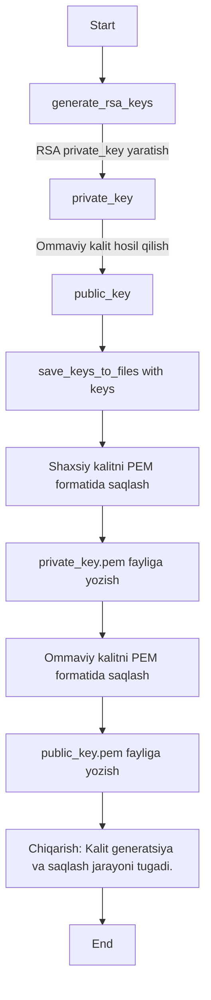

# kiberxavfsizlik

```mermaid
flowchart TD
    A[Start] --> B[generate_rsa_keys]
    B -->|RSA private_key yaratish| C[private_key]
    C -->|Ommaviy kalit hosil qilish| D[public_key]
    D --> E[save_keys_to_files with keys]

    E --> F[Shaxsiy kalitni PEM formatida saqlash]
    F --> G[private_key.pem fayliga yozish]
    G --> H[Ommaviy kalitni PEM formatida saqlash]
    H --> I[public_key.pem fayliga yozish]

    I --> J[Chiqarish: Kalit generatsiya va saqlash jarayoni tugadi.]
    J --> K[End]
```
