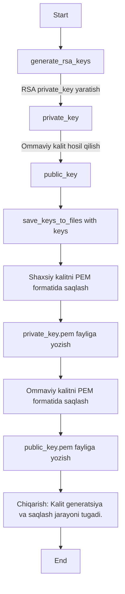

# kiberxavfsizlik


```mermaid
    A[Start] --> B[Generate RSA Private Key]
    B --> C[Extract Public Key]
    C --> D[Prepare Data Dictionary]
    D --> E[Canonicalize Data]
    E --> F[Convert to Bytes]
    F --> G[Sign Data with Private Key<br/>PSS + SHA256]
    G --> H[Save Private Key to private_key.pem]
    G --> I[Save Public Key to public_key.pem]
    G --> J[Save Signature to signature.bin]
    J --> K[Print Success Message]
    K --> L[End]
```

```mermaid
  flowchart TD
    A[Start] --> B[Load Public Key from public_key.pem]
    B --> C[Load Signature from signature.bin]
    C --> D[Prepare Data Dictionary]
    D --> E[Canonicalize Data<br/>(sorted key=value pairs)]
    E --> F[Convert to Bytes (UTF-8)]
    F --> G[Verify Signature with Public Key<br/>PSS + SHA256]
    G -->|Success| H[Print ✅ Imzo TO'G'RI]
    G -->|Failure| I[Print ❌ Imzo XATO + Exception]
    H --> J[Return True]
    I --> K[Return False]
    J --> L[End]
    K --> L[End]
```
